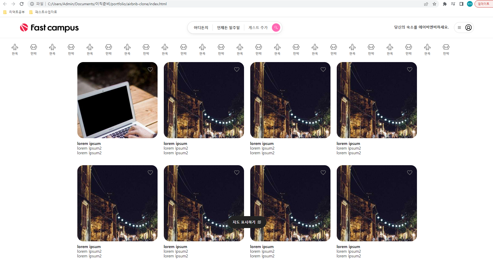
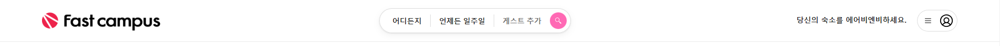
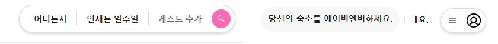
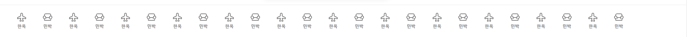
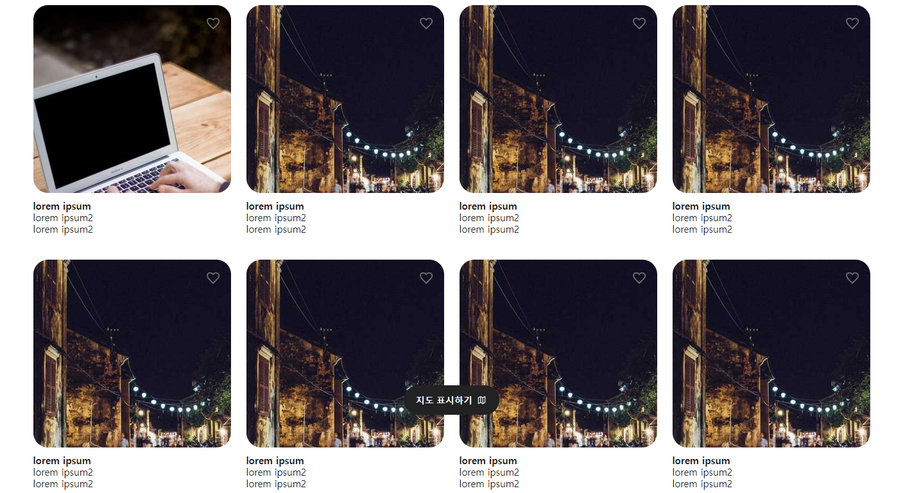
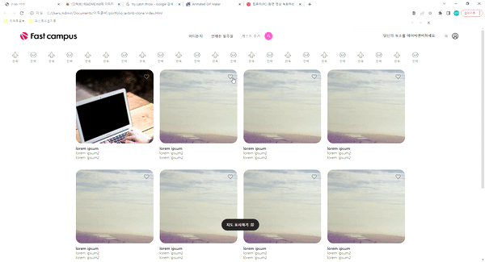

# airbnb-clone
Vanila Javascript 사용하여 aribnb 클론 해보기 프로젝트

## 구성

1. Header
 

  기초 html 과 css 연습 시작
  특히 display: flex를 사용하여 세로 방향 css 편집 연습
  item 배열은 **space-between**을 사용하여 아이템끼리만 간격을 설정

  

  - 각각 item에 마우스를 올리면 그림자 및 강조가 된다.

2. Category
  
  - 버튼 목록들을 나열, 주어진 영역을 벗어나면 스크롤로 표시되지만 스크롤을 숨겨놓는다.

  
  - 마우스를 버튼에 올리면 밑줄로 강조가 된다.
  - 클릭시 검은색으로 강조, 같은 아이템 클릭 시 강조가 풀린다. 

3. Main
  
  - display: grid를 사용하여 image 를 배열했다.
  - 하트 icon을 우측 상단에 배치

  
  - 클릭 시 하트가 작아졌다 본래 크기로 돌아오는 애니메이션을 넣었다.

4. Floating Button
  
  - 스크롤바를 사용해도 항상 같은 위치에 있는 버튼

===========================================================================

### Web 이론
  - DOM (Document Object Model)
    -- 웹 문서(html)의 객체모델 인터페이스
    -- 돔은 자바스크립트로 수정될수 있는 api 제공해줌
    -- method example
       document.querySelectorAll(), ~~

## css 많이 사용되는 요소
  
  - display: flex 란?
   
    가로 정렬에 많이 사용됨
    하위 item은 flex: (크게비율) (작게비율) (초기값)  
                        grow       shrink    basis

    -- 정렬기준 => justify-content: space-between 요소간의 간격을 일정
                              space-around 요소간의 간경을 일정(컨테이너와도)

    --flex 사용시 => item 사이값 조절 :  gab 사용 편리!

  - view 영역 밖으로 object가 넘칠때 
    = overflow: auto;
    사용하면 스크롤로 해당 영역 표시가능

    아래 코드 사용하면 bar가 보이지 않음
    #catagory-bar::-webkit-scrollbar {
      display: none;
    }

  - CSS Position = 문서상에 요소를 배치하는 방법

  - diplay: grid 
    = > grid-template-columns: repeat(4, 308px)
        4개씩 반복해서 308px를 구성하겠다.

## css reset 코드

  브라우저에서 기본으로 css를 설정해놓은 것을 reset 할 수 있도록 도와준다
    
    /* http://meyerweb.com/eric/tools/css/reset/ 
    v2.0 | 20110126
    License: none (public domain)
    */

    html, body, div, span, applet, object, iframe,
    h1, h2, h3, h4, h5, h6, p, blockquote, pre,
    a, abbr, acronym, address, big, cite, code,
    del, dfn, em, img, ins, kbd, q, s, samp,
    small, strike, strong, sub, sup, tt, var,
    b, u, i, center,
    dl, dt, dd, ol, ul, li,
    fieldset, form, label, legend,
    table, caption, tbody, tfoot, thead, tr, th, td,
    article, aside, canvas, details, embed, 
    figure, figcaption, footer, header, hgroup, 
    menu, nav, output, ruby, section, summary,
    time, mark, audio, video {
      margin: 0;
      padding: 0;
      border: 0;
      font-size: 100%;
      font: inherit;
      vertical-align: baseline;
    }
    /* HTML5 display-role reset for older browsers */
    article, aside, details, figcaption, figure, 
    footer, header, hgroup, menu, nav, section {
      display: block;
    }
    body {
      line-height: 1;
    }
    ol, ul {
      list-style: none;
    }
    blockquote, q {
      quotes: none;
    }
    blockquote:before, blockquote:after,
    q:before, q:after {
      content: '';
      content: none;
    }
    table {
      border-collapse: collapse;
      border-spacing: 0;
    }
